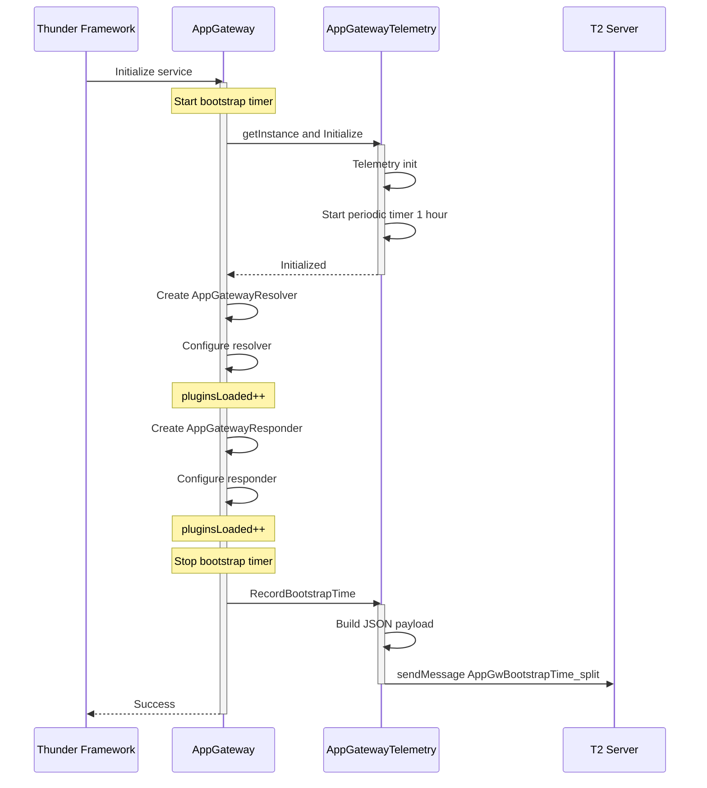
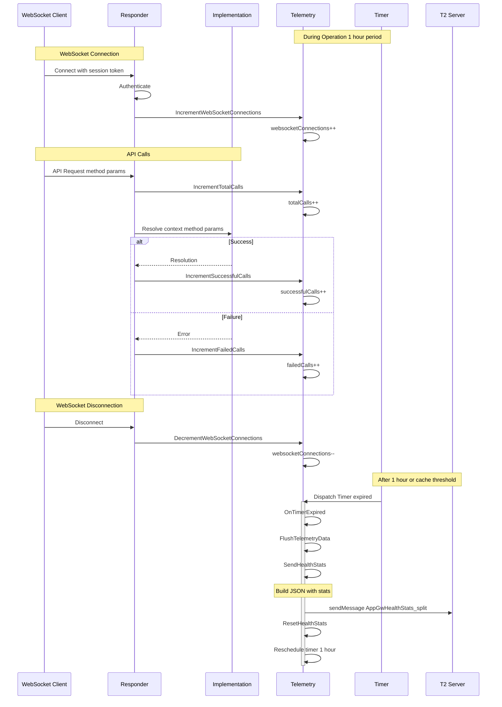
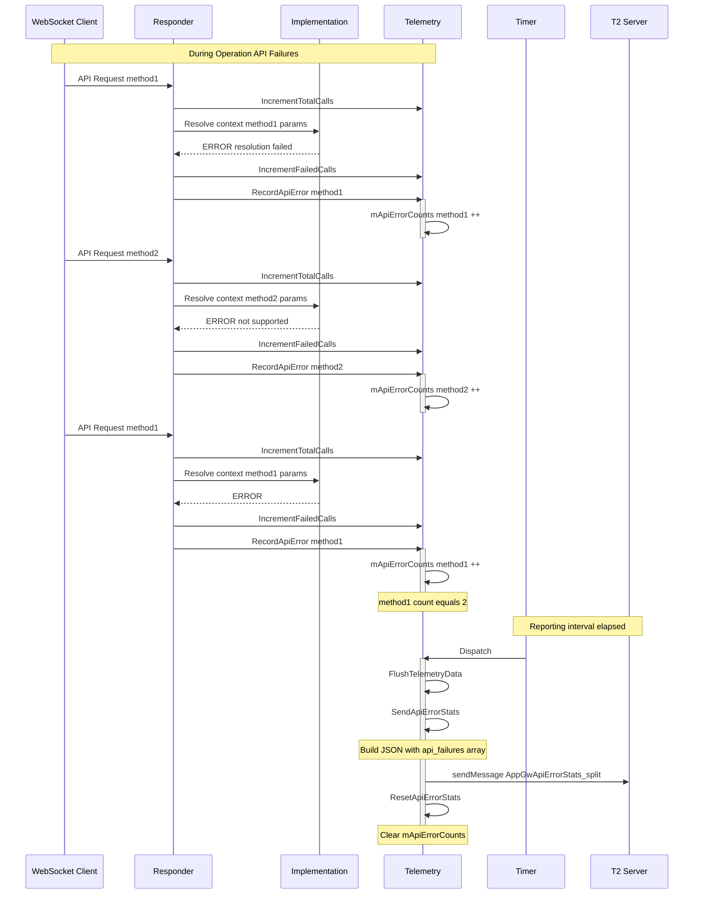
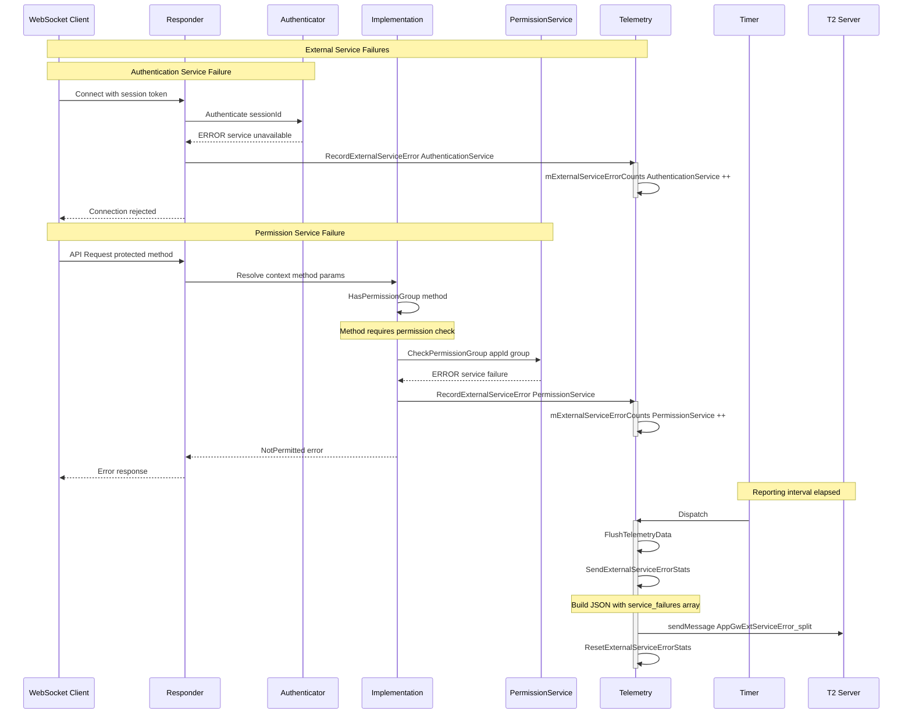
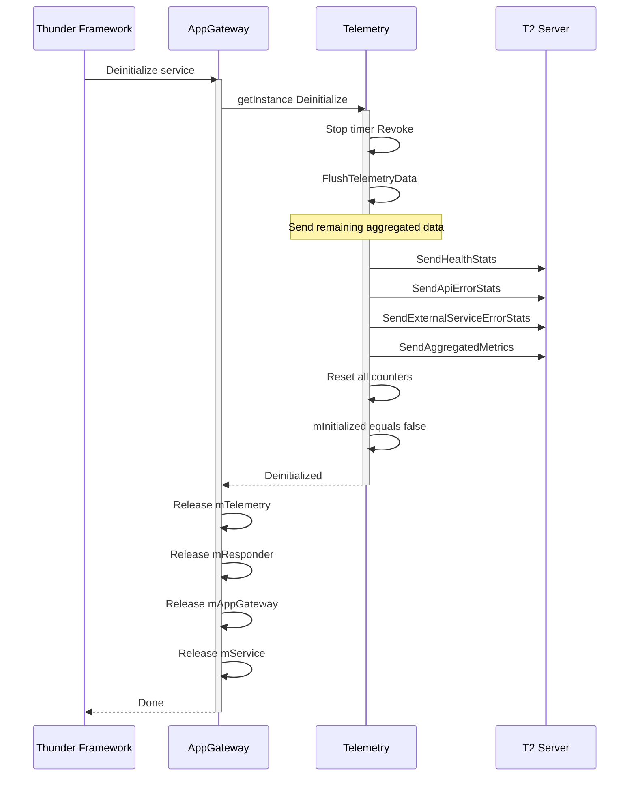
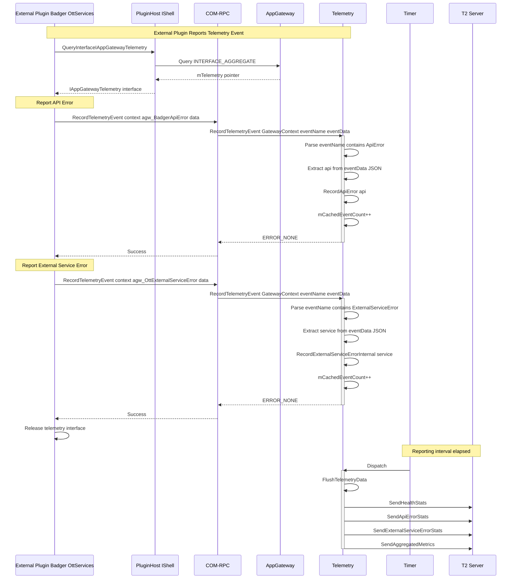
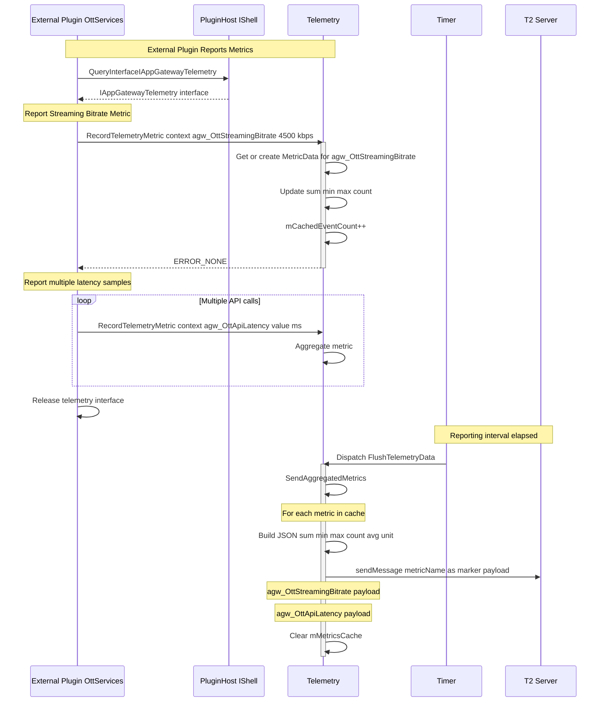

# App Gateway Telemetry - Sequence Diagrams

## Scenario 1: Bootstrap Time Recording

## Scenario 2: Health Stats Reporting

## Scenario 3: API Error Stats Reporting

## Scenario 4: External Service Error Reporting

## Shutdown Sequence

## Scenario 5: External Plugin COM-RPC Telemetry

This diagram shows how external plugins (Badger, OttServices, etc.) report telemetry to AppGateway via COM-RPC.

## Scenario 6: External Plugin Metric Recording

## Data Flow Summary

```mermaid
flowchart TD
    subgraph Sources[Telemetry Sources]
        A1[AppGateway - Bootstrap Time]
        A2[Responder - WS Connections]
        A3[Responder - API Calls]
        A4[Responder - Auth Errors]
        A5[Implementation - Permission Errors]
        A6[External Plugins via COM-RPC]
    end

    subgraph Aggregator[AppGatewayTelemetry Singleton]
        B1[HealthStats atomics]
        B2[ApiErrorCounts map]
        B3[ExtServiceErrors map]
        B4[MetricsCache map]
        B5[TelemetryTimer 1 hour]
    end

    subgraph Output[T2 Telemetry]
        C1[AppGwBootstrapTime_split]
        C2[AppGwHealthStats_split]
        C3[AppGwApiErrorStats_split]
        C4[AppGwExtServiceError_split]
        C5[Custom metric markers]
    end

    A1 -->|RecordBootstrapTime| C1
    A2 -->|Increment Decrement WS| B1
    A3 -->|Increment Calls| B1
    A3 -->|RecordApiError| B2
    A4 -->|RecordExtServiceError| B3
    A5 -->|RecordExtServiceError| B3
    A6 -->|RecordTelemetryEvent| B2
    A6 -->|RecordTelemetryEvent| B3
    A6 -->|RecordTelemetryMetric| B4

    B5 -->|Timer Expired| B1
    B5 -->|Timer Expired| B2
    B5 -->|Timer Expired| B3
    B5 -->|Timer Expired| B4

    B1 -->|SendHealthStats| C2
    B2 -->|SendApiErrorStats| C3
    B3 -->|SendExtServiceErrors| C4
    B4 -->|SendAggregatedMetrics| C5
```

