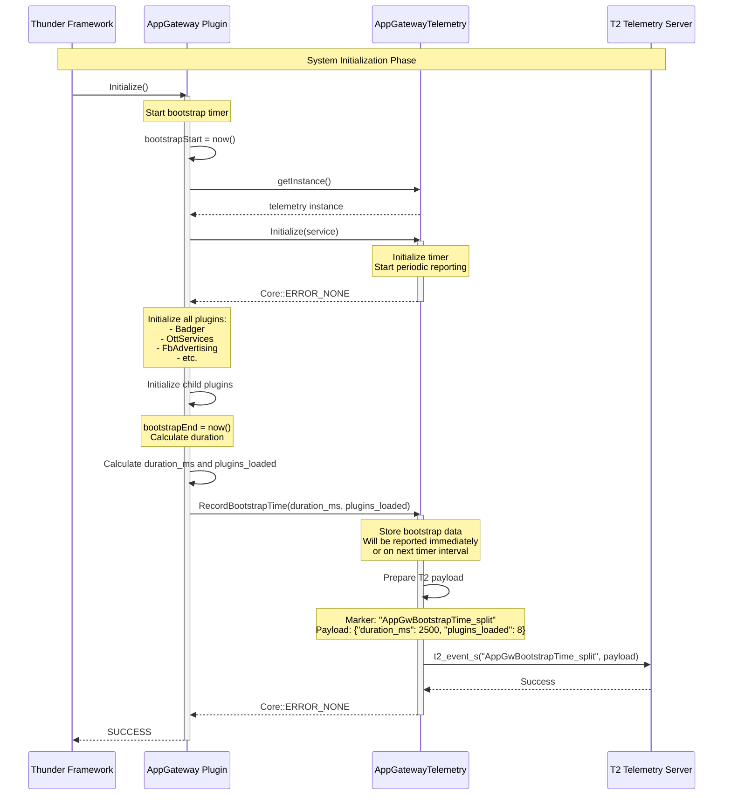

# Scenario 1: Bootstrap Time Tracking

## Overview

This sequence diagram illustrates how App Gateway measures and reports the total time taken to initialize all plugins during system bootstrap.

## Sequence Diagram



## Key Components

| Component | Responsibility |
|-----------|---------------|
| **Thunder Framework** | Initiates plugin loading sequence |
| **AppGateway Plugin** | Measures bootstrap time across all child plugins |
| **AppGatewayTelemetry** | Aggregates and reports bootstrap metrics to T2 |
| **T2 Telemetry Server** | Receives and stores telemetry data |

## Data Flow

1. **Bootstrap Start**: AppGateway records timestamp when `Initialize()` is called
2. **Plugin Initialization**: All child plugins (Badger, OttServices, etc.) are loaded
3. **Bootstrap End**: After all plugins load, calculate total duration
4. **Telemetry Recording**: Report bootstrap time and plugin count to telemetry
5. **T2 Reporting**: Telemetry formats and sends data to T2 server

## T2 Marker

**Marker Name:** `AppGwBootstrapTime_split`

**Payload Format (JSON):**
```json
{
  "duration_ms": 2500,
  "plugins_loaded": 8
}
```

**Payload Format (COMPACT):**
```
2500,8
```

## Configuration

- **Reporting**: Immediate upon bootstrap completion
- **Frequency**: Once per system start
- **Format**: Configurable via `SetTelemetryFormat()` (JSON or COMPACT)

## Notes

- Bootstrap time is critical for measuring system startup performance
- Helps identify slow plugin initialization
- Reported only once during AppGateway initialization
- Independent of periodic telemetry reporting interval
