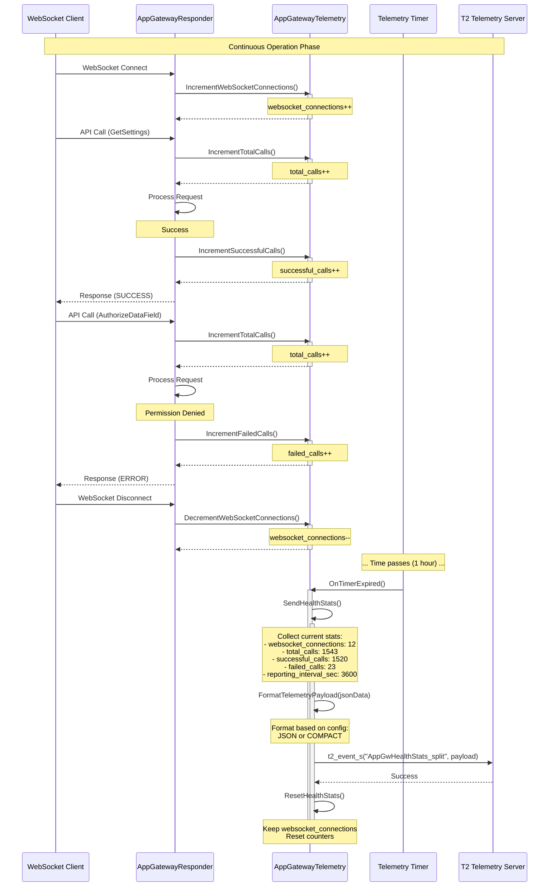

# Scenario 2: Health Stats Periodic Reporting

## Overview

This sequence diagram illustrates how App Gateway continuously tracks WebSocket connections and API call statistics, reporting aggregated health metrics at regular intervals (default: 1 hour).

## Sequence Diagram



## Key Components

| Component | Responsibility |
|-----------|---------------|
| **WebSocket Client** | Frontend applications connecting to AppGateway |
| **AppGatewayResponder** | Handles WebSocket connections and API calls |
| **AppGatewayTelemetry** | Tracks connection and call statistics |
| **Telemetry Timer** | Triggers periodic reporting (default: 1 hour) |
| **T2 Telemetry Server** | Receives and stores health metrics |

## Tracked Metrics

| Metric | Description | Reset After Reporting? |
|--------|-------------|----------------------|
| `websocket_connections` | Current active WebSocket connections | No (current state) |
| `total_calls` | Total API calls in reporting period | Yes |
| `successful_calls` | Number of successful API calls | Yes |
| `failed_calls` | Number of failed API calls | Yes |
| `reporting_interval_sec` | Reporting interval in seconds | No (config value) |

## T2 Marker

**Marker Name:** `AppGwHealthStats_split`

**Payload Format (JSON):**
```json
{
  "websocket_connections": 12,
  "total_calls": 1543,
  "successful_calls": 1520,
  "failed_calls": 23,
  "reporting_interval_sec": 3600
}
```

**Payload Format (COMPACT):**
```
12,1543,1520,23,3600
```

## Configuration

- **Default Interval**: 3600 seconds (1 hour)
- **Configurable via**: `SetReportingInterval(intervalSec)`
- **Format**: Configurable via `SetTelemetryFormat()` (JSON or COMPACT)
- **Reset Behavior**: Call counters reset after each report; connection count persists

## Call Flow

1. **Connection Tracking**: WebSocket connect/disconnect events update connection count
2. **Call Tracking**: Each API call increments total; success/failure tracked separately
3. **Timer Expiration**: After configured interval, timer triggers reporting
4. **Data Collection**: Aggregate all tracked metrics
5. **Format Conversion**: Convert to JSON or COMPACT based on configuration
6. **T2 Reporting**: Send formatted payload to T2 server
7. **Reset Counters**: Reset call counters (keep connection count)

## Notes

- Connection count is a **current state** (not reset)
- Call counters are **cumulative** over the reporting interval (reset after reporting)
- Success rate can be calculated: `successful_calls / total_calls * 100`
- Failure rate: `failed_calls / total_calls * 100`
