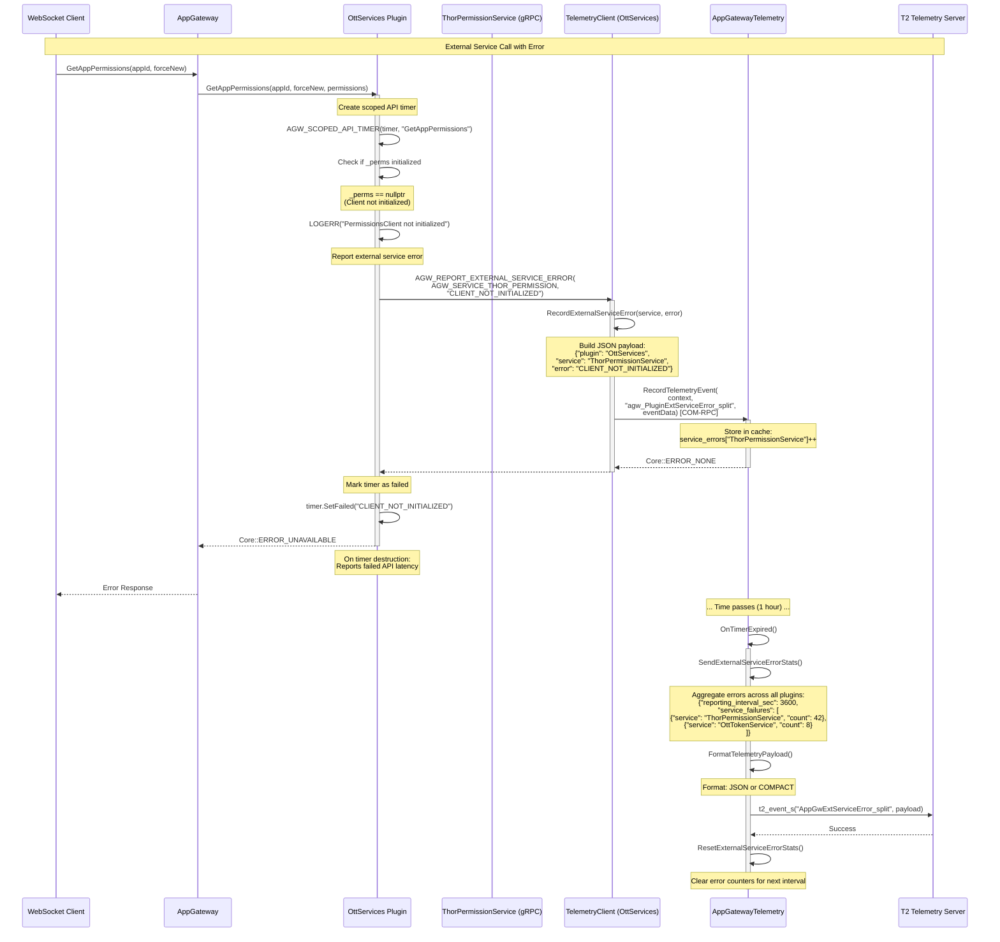

# Scenario 4: External Service Error Reporting (OttServices Plugin Example)

## Overview

This sequence diagram illustrates how the OttServices plugin reports external service errors to App Gateway via COM-RPC. The example shows `GetAppPermissions` failing when the ThorPermissionService gRPC client is not initialized.

## Sequence Diagram



## Key Components

| Component | Responsibility |
|-----------|---------------|
| **WebSocket Client** | Initiates permission check via AppGateway |
| **AppGateway** | Routes request to OttServices plugin |
| **OttServices Plugin** | Manages app permissions via ThorPermissionService |
| **ThorPermissionService** | External gRPC service for permission checks |
| **TelemetryClient** | Helper class in OttServices for telemetry reporting |
| **AppGatewayTelemetry** | Aggregates errors from all plugins and reports to T2 |
| **T2 Telemetry Server** | Receives aggregated error statistics |

## Error Flow

1. **API Call**: Client requests app permissions via AppGateway
2. **Service Check**: OttServices checks if ThorPermissionService client is initialized
3. **Error Detection**: gRPC client is not initialized
4. **Error Logging**: OttServices logs error with context
5. **Telemetry Reporting**: Report external service error via `AGW_REPORT_EXTERNAL_SERVICE_ERROR`
6. **COM-RPC Call**: TelemetryClient calls AppGatewayTelemetry via COM-RPC
7. **Error Aggregation**: AppGatewayTelemetry increments error counter for "ThorPermissionService"
8. **Timer Tracking**: Scoped timer marks API call as failed
9. **Client Response**: Return error code to client
10. **Periodic Reporting**: Aggregated errors from all plugins sent to T2 every hour

## Generic Marker System

### Event Marker (Immediate - per plugin)
**Marker:** `agw_PluginExtServiceError_split`
**Payload (OttServices):**
```json
{
  "plugin": "OttServices",
  "service": "ThorPermissionService",
  "error": "CLIENT_NOT_INITIALIZED"
}
```

**Payload (Badger - different plugin, same marker):**
```json
{
  "plugin": "Badger",
  "service": "OttServices",
  "error": "INTERFACE_UNAVAILABLE"
}
```

### Aggregated Stats Marker (Periodic - all plugins combined)
**Marker:** `AppGwExtServiceError_split`
**Payload (JSON format):**
```json
{
  "reporting_interval_sec": 3600,
  "service_failures": [
    {"service": "ThorPermissionService", "count": 42},
    {"service": "OttTokenService", "count": 8},
    {"service": "LifecycleDelegate", "count": 15},
    {"service": "OttServices", "count": 3}
  ]
}
```

**Payload (COMPACT format):**
```
3600,(ThorPermissionService,42),(OttTokenService,8),(LifecycleDelegate,15),(OttServices,3)
```

## Predefined Constants Used

```cpp
// From AppGatewayTelemetryMarkers.h
#define AGW_PLUGIN_OTTSERVICES                "OttServices"
#define AGW_SERVICE_THOR_PERMISSION           "ThorPermissionService"
#define AGW_SERVICE_OTT_TOKEN                 "OttTokenService"
#define AGW_MARKER_PLUGIN_EXT_SERVICE_ERROR   "agw_PluginExtServiceError_split"
```

## Multi-Plugin Aggregation

The key benefit of the generic marker system is that errors from **all plugins** are aggregated into a single report:

| Service Name | Source Plugin | Error Count (1 hour) |
|--------------|---------------|---------------------|
| ThorPermissionService | OttServices | 42 |
| OttTokenService | OttServices | 8 |
| LifecycleDelegate | Badger | 15 |
| OttServices | Badger | 3 |

All reported under the same marker: `AppGwExtServiceError_split`

## Configuration

- **Reporting Interval**: Default 3600 seconds (1 hour), configurable
- **Format**: JSON (self-describing) or COMPACT (minimal), configurable
- **Reset**: Error counters reset after each periodic report
- **Granularity**: Per-service error counts (not per-plugin)

## Notes

- **Service-level tracking**: Errors tracked by service name, not plugin name
- **Cross-plugin visibility**: Analytics can see all service errors regardless of which plugin reported them
- **Immediate vs Aggregated**: Individual events can be sent immediately, aggregated stats sent periodically
- **Generic markers**: Single marker `agw_PluginExtServiceError_split` used by all plugins
- **Payload differentiation**: Plugin name in payload allows filtering by source
- **gRPC services**: Common pattern for OttServices to report gRPC client errors
