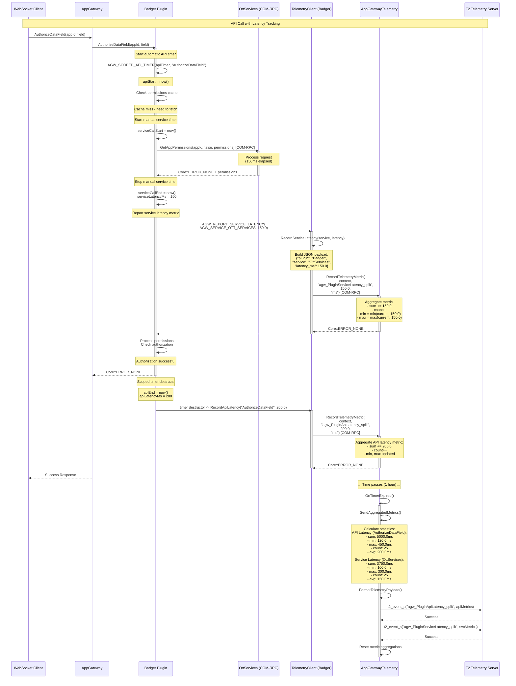

# Scenario 5: API and Service Latency Tracking (Metric Reporting)

## Overview

This sequence diagram illustrates how plugins track API call latency and external service call latency using both automatic (scoped timer) and manual timing methods. Examples from both Badger and OttServices plugins demonstrate `RecordTelemetryMetric` usage.

## Sequence Diagram



## Key Components

| Component | Responsibility |
|-----------|---------------|
| **WebSocket Client** | Initiates API call requiring permission check |
| **AppGateway** | Routes request to Badger plugin |
| **Badger Plugin** | Performs authorization, tracks API latency automatically |
| **OttServices** | Provides permission data via COM-RPC |
| **TelemetryClient** | Reports both API and service latency metrics |
| **AppGatewayTelemetry** | Aggregates metrics (sum, min, max, count, avg) |
| **T2 Telemetry Server** | Receives aggregated latency statistics |

## Timing Methods

### 1. Automatic API Latency (Scoped Timer)

```cpp
Core::hresult Badger::AuthorizeDataField(...) {
    AGW_SCOPED_API_TIMER(apiTimer, "AuthorizeDataField");
    
    // ... API implementation ...
    
    if (error) {
        apiTimer.SetFailed(errorCode);  // Mark as failed
        return ERROR;
    }
    
    return SUCCESS;
    // Timer destructor automatically reports latency
}
```

**Benefits:**
- RAII-style automatic timing
- Handles both success and failure cases
- No manual timing code needed
- Guaranteed reporting even with early returns

### 2. Manual Service Latency

```cpp
// Start timer before external service call
auto serviceCallStart = std::chrono::steady_clock::now();

// Call external service
auto result = ottServices->GetAppPermissions(...);

// Stop timer after service call
auto serviceCallEnd = std::chrono::steady_clock::now();
auto serviceLatencyMs = std::chrono::duration_cast<std::chrono::milliseconds>(
    serviceCallEnd - serviceCallStart).count();

// Report service latency
AGW_REPORT_SERVICE_LATENCY(AGW_SERVICE_OTT_SERVICES, static_cast<double>(serviceLatencyMs));
```

**Benefits:**
- Precise measurement of specific service calls
- Can measure individual steps within an API call
- Flexible timing granularity

## Generic Markers for Metrics

### API Latency Marker
**Marker:** `agw_PluginApiLatency_split`
**Payload (JSON):**
```json
{
  "plugin": "Badger",
  "api": "AuthorizeDataField",
  "sum": 5000.0,
  "min": 120.0,
  "max": 450.0,
  "count": 25,
  "avg": 200.0,
  "unit": "ms",
  "reporting_interval_sec": 3600
}
```

**Payload (COMPACT):**
```
Badger,AuthorizeDataField,5000.0,120.0,450.0,25,200.0,ms,3600
```

### Service Latency Marker
**Marker:** `agw_PluginServiceLatency_split`
**Payload (JSON):**
```json
{
  "plugin": "Badger",
  "service": "OttServices",
  "sum": 3750.0,
  "min": 100.0,
  "max": 300.0,
  "count": 25,
  "avg": 150.0,
  "unit": "ms",
  "reporting_interval_sec": 3600
}
```

## Metric Aggregation

AppGatewayTelemetry aggregates metrics over the reporting interval:

| Statistic | Calculation | Purpose |
|-----------|-------------|---------|
| `sum` | Σ(all latency values) | Total time spent |
| `min` | min(all latency values) | Best case performance |
| `max` | max(all latency values) | Worst case performance |
| `count` | Number of samples | Call frequency |
| `avg` | sum / count | Average latency |
| `unit` | "ms" | Measurement unit |

## Multi-Plugin Metric Tracking

Different plugins can track the same or different APIs/services:

| Plugin | API/Service | Metric Type | Marker |
|--------|-------------|-------------|--------|
| Badger | AuthorizeDataField | API Latency | `agw_PluginApiLatency_split` |
| Badger | OttServices | Service Latency | `agw_PluginServiceLatency_split` |
| OttServices | GetAppPermissions | API Latency | `agw_PluginApiLatency_split` |
| OttServices | ThorPermissionService | Service Latency | `agw_PluginServiceLatency_split` |
| OttServices | OttTokenService | Service Latency | `agw_PluginServiceLatency_split` |

All use the same generic markers, differentiated by plugin name in payload.

## Configuration

- **Reporting Interval**: Default 3600 seconds (1 hour), configurable
- **Format**: JSON (self-describing) or COMPACT (minimal)
- **Reset**: Metric aggregations reset after each report
- **Granularity**: Per API/service, per plugin

## Performance Insights

Latency metrics enable:
1. **SLA Monitoring**: Track if APIs meet latency SLAs
2. **Bottleneck Identification**: Identify slow services (high max, high avg)
3. **Trend Analysis**: Compare latency over time
4. **Capacity Planning**: Understand call frequency (count) and total time (sum)
5. **Performance Regression Detection**: Detect when latency increases

## Notes

- **Automatic timing**: Preferred for API latency (scoped timer)
- **Manual timing**: Used for granular service call measurement
- **C++11 compatible**: Uses `std::chrono::steady_clock` (monotonic, not affected by time changes)
- **Zero overhead when telemetry unavailable**: Macros check availability before timing
- **Thread-safe**: AppGatewayTelemetry uses locks for metric aggregation
- **Failed API latency**: Scoped timer can track failed API call latency separately
